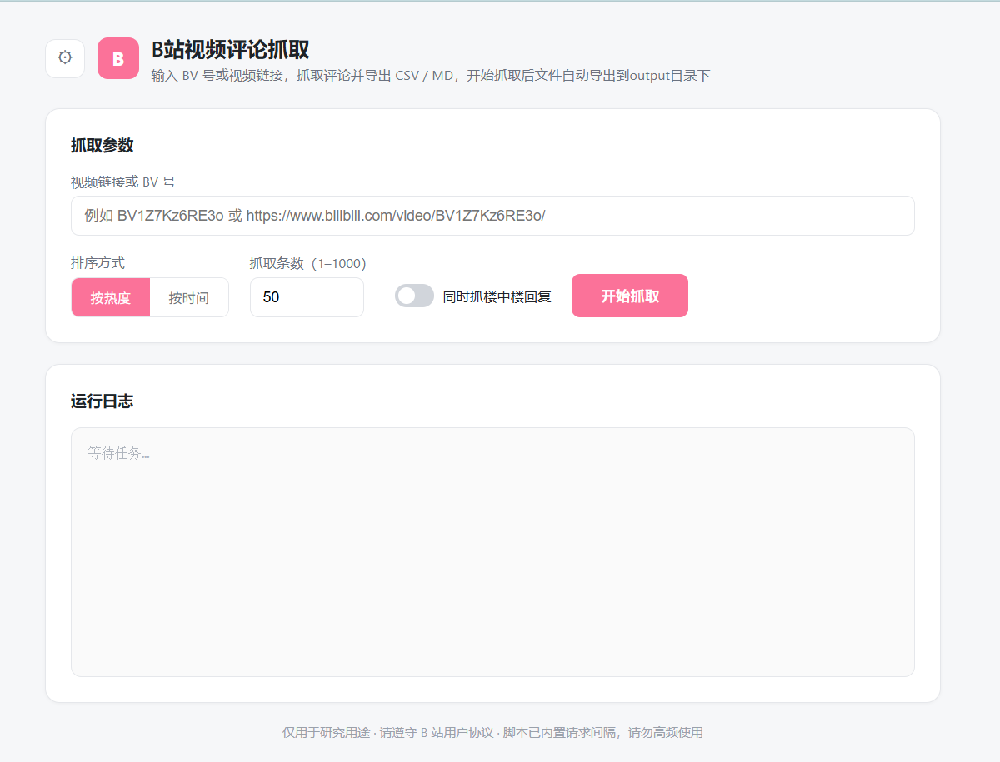
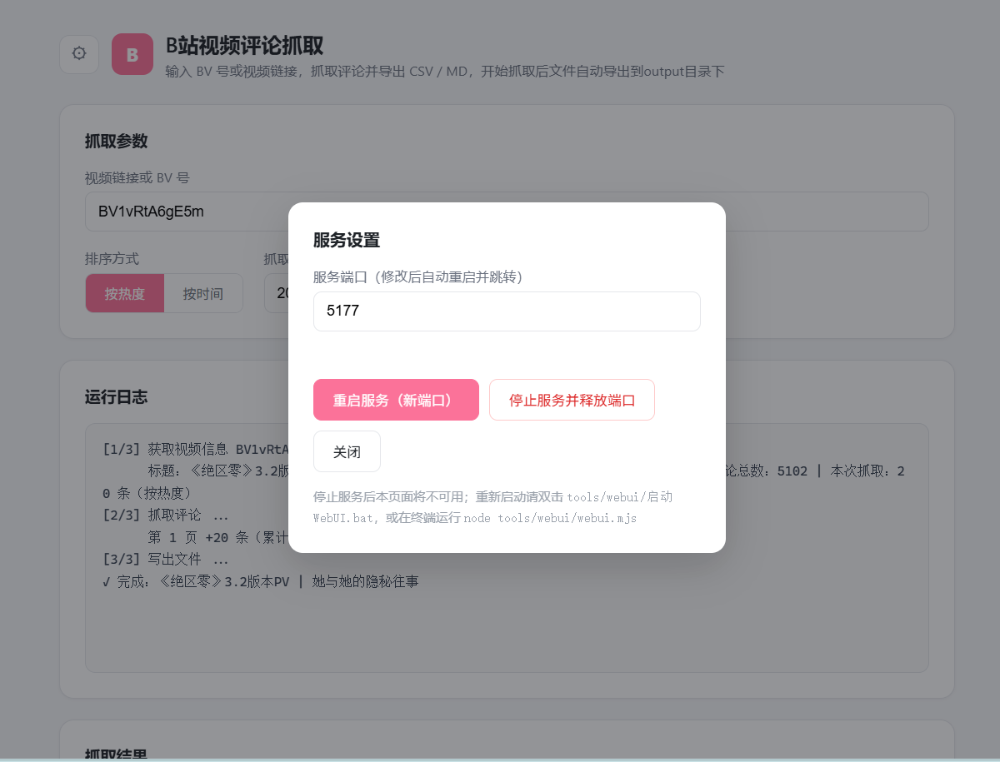

# B站视频评论查看工具（bili-comments）

零依赖的 B 站视频评论查看工具：命令行直接用，也带一个本地 WebUI。输入 BV 号或视频链接，按热度/时间选取评论（可选楼中楼回复），自动导出 CSV + Markdown 文件，结果页同时展示视频 UP主及其 UID。建议在浏览器上先登录自己的账号，防止游客默认权限只能读取3条评论。
**警告**：非人工项目，未经历完整的边界测试以及设备兼容性，千万评论提取暂未测试，作者本机是Window11系统，Node.js版本是22，使用Edge/Chrom浏览器，只保证了该工具能在本机正常运行工作。

**备注**：写了默认90s页面没响应服务自杀，目前在.bat添加了变量HEARTBEAT_TTL_MS=500000，也就是7分钟无响应再杀死服务，为防止意外抓取和使用的时候保证页面小窗口运行，防止页面睡眠机制杀死服务，可通过在start-WebUI.bat添加变量参数修改时间，详细查看下面[注意事项](#注意)。自己测试了**抓取10万条评论**，不改变请求间隔1.1s/页 20条评论的情况下耗时1h多，以及此时WebUI请求结果那里会**卡掉不显示进度**，但是**服务还在进行**，**等待即可**，最后会完成评论抓取并有概率退出服务。工具还没写抓取过程的中断，应该停掉服务即可。

> 仅供研究学习用途。请遵守 B 站用户协议与 robots 规则；脚本已内置约 1.1s/页 的请求间隔，请勿调高频率，以免触发风控。

---


---

## 功能介绍

**命令行工具（`bili-comments.mjs`）**

- 支持 BV 号或完整视频 URL 输入（自动用正则提取 BV 号）
- 两种排序：按热度（热评优先）/ 按时间（最新优先）
- 自定义抓取条数，超过视频评论总数时自动截断并提示
- 可选抓取楼中楼回复（每条主评论最多翻 10 页子回复）
- 双格式导出：CSV（UTF-8 带 BOM，Excel 双击直接打开不乱码）+ Markdown 表格
- 文件名自动清洗（去除 Windows/macOS/Linux 非法字符、控制字符，限长 80）
- 最终向 stdout 输出 JSON 结果（含标题、BV 号、UP主名、UID、抓取数、文件路径），方便被其他程序调用

**WebUI（`webui/`）**

- 浏览器表单操作：视频链接、排序方式、抓取条数（1–1000）、楼中楼开关
- 运行日志实时流式显示（NDJSON 逐行推送）
- 结果卡片：视频标题、UP主（点击跳转其 B 站空间）、UID、本次抓取数 / 评论总数、CSV / MD 下载按钮、评论预览表格
- 单任务互斥：同一时间只允许一个抓取任务，避免并发触发 B 站风控
- 服务设置弹窗：页面内改端口热重启、一键停止服务释放端口
- 页面心跳看门狗：默认所有浏览器页面关闭（休眠）约 90 秒后，服务自动退出、释放端口，可以在start-WebUI.bat那添加修改变量

  ```
  set "HEARTBEAT_TTL_MS=500000"
  ```

  进行更改

## 快速开始

环境要求：**Node.js ≥ 18**（使用了全局 `fetch`），无第三方依赖，未安装Node.js可搜索官网进行安装，也可以提前安装版本管理工具如nvm / fnn 等等方便后续进行Node.js管理。
浏览器推荐使用Edge和Chrom，其余的浏览器没测试兼容。

**方式一：命令行**

```bash
node bili-comments.mjs BV1Z7Kz6RE3o --sort time --count 200 --out ./out
node bili-comments.mjs "https://www.bilibili.com/video/BV1Z7Kz6RE3o/" --count 100 --replies
```

**方式二：WebUI（Windows）**

双击 `webui/start-WebUI.bat`，浏览器自动打开 `http://localhost:5177`。

**方式三：WebUI（任意平台）**

```bash
node webui/webui.mjs          # 默认端口 5177
node webui/webui.mjs 8080     # 指定端口
```

输出文件写入 `webui/output/`（命令行默认当前目录，可用 `--out` 指定）。

## 界面演示

主页面



​	设置界面



结果界面


## 参数解释

### 命令行参数（`bili-comments.mjs`）

| 参数 | 取值 | 默认值 | 说明 |
|---|---|---|---|
| `<BV号或URL>` | 含 BV 号的任意文本 | 必填 | 用正则 `BV1[0-9A-Za-z]{9}` 提取，完整链接可直接粘贴 |
| `--sort` | `hot` / `time` | `hot` | `hot`=按热度，`time`=按时间 |
| `--count` | 正整数 | `50` | 抓取条数；超过视频评论总数时自动截断到总数，总条数包含主评论数和楼中楼回复，开启楼中楼回复请注意数目差距 |
| `--out` | 目录路径 | `.`（当前目录） | CSV / MD 输出目录，不存在会自动创建 |
| `--replies` | （开关，无需值） | 关闭 | 同时抓取楼中楼回复，会显著增加请求数和耗时 |

### WebUI 环境变量

| 变量 | 默认值 | 说明 |
|---|---|---|
| `PORT` | `5177` | 服务监听端口（仅绑定 `127.0.0.1`，不对外暴露） |
| `HEARTBEAT_TTL_MS` | `90000` | 页面心跳超时时间，单位毫秒，超时后服务自动退出 |
| `TASK_STUCK_TIMEOUT_MS` | `600000` | 任务卡死判定：心跳超时且任务超过此时长无任何进展输出，先回收任务再重置心跳计时 |


## 各文件介绍

```
tools/
|—— img                    存放图片
├── bili-comments.mjs      核心抓取脚本（CLI），零依赖，可独立使用
└── webui/
    ├── index.html         WebUI 前端（单文件：页面结构 + 样式 + 交互逻辑）
    ├── server.mjs         本地 HTTP 服务：静态文件、/api/fetch 调度、结果转发、文件下载
    ├── webui.mjs          启动器 / 守护进程：拉起 server.mjs，支持端口热切换
    ├── start-WebUI.bat       Windows 一键启动（自动找 node、端口占用检测、自动开浏览器）
    └── output/            抓取结果输出目录（CSV + MD）
```

| 文件 | 职责 | 关键设计 |
|---|---|---|
| `bili-comments.mjs` | 请求 | 进度走 **stderr**、最终结果 JSON 走 **stdout**，天然支持流式转发 |
| `server.mjs` | WebUI 后端 | 不修改原脚本，用 `child_process.spawn` 以命令行参数调用；`busy` 标志做单任务互斥 |
| `webui.mjs` | 守护进程 | 通过 `.restart` 标记文件实现「退出 → 新端口重启」的热切换 |
| `index.html` | 前端 | 原生 JS 读 NDJSON 流（`response.body.getReader()`），无需任何框架 |
| `start-WebUI.bat` | 启动入口 | 纯 ASCII 内容（路径含中文，用 `%~dp0` 定位）；优先 PATH 中的 node，找不到则回退到 WorkBuddy 托管运行时 |


## 注意

### 网页前端心跳监听

- **服务端有心跳超时自杀机制**（`webui/server.mjs` 第 54-112 行，200行）

```js
const HEARTBEAT_TTL_MS = Number(process.env.HEARTBEAT_TTL_MS) || 90_000;

// 停止服务，释放端口
function handleShutdown(req, res) {
  if (busy)
    return sendJson(res, 409, {
      ok: false,
      message: "有抓取任务正在进行，请等它完成后再停止服务",
    });
  sendJson(res, 200, { ok: true });
  setTimeout(() => process.exit(0), 300); // 等响应送达后再退出
}
```

服务端每过一段时间检查一次：如果超过 **90 秒**没收到任何页面心跳，就判定"所有 WebUI 页面都已关闭"，主动 `process.exit(0)` 退出。

- **心跳靠前端页面定时发送**（`webui/index.html` 第 481-483 行）

```js
const heartbeat = () => fetch('/api/heartbeat', { method: 'POST' });
heartbeat();
setInterval(heartbeat, 5000);  // 每 5 秒发一次
```

 `setInterval` 每 5 秒 POST 一次心跳，服务端收到就刷新 `lastHeartbeatAt`。

因此浏览器的标签页休眠会触发服务自杀机制，重启服务即可，或者保持标签页活跃即可。

也可以修改超时时间。在start-WebUI.bat进行修改：

服务端支持环境变量 `HEARTBEAT_TTL_MS`。改 `start-WebUI.bat`，在第 12 行 `set "PORT=5177"` 下面加一行，比如改成 30 分钟（单位是毫秒）：

bat

```bat
set "HEARTBEAT_TTL_MS=1800000"
```

（`start "BiliCommentsWebUI" ... cmd /c` 会继承这个环境变量）

### 翻页与风控

- `wbi/main` 使用游标翻页：响应中 `cursor.pagination_reply.next_offset` 作为下一页的 `pagination_str.offset`，`cursor.is_end` 标记结束
- 每翻一页 sleep **1.1 秒**（`PAGE_DELAY_MS`），这是防风控的核心手段，**不建议调小**
- WebUI 层再加一道 `busy` 互斥锁，保证不会并发打接口

### WebUI 的部分工程细节（非人工）

- **进度流式化**：CLI 脚本人为约定「日志走 stderr、结果走 stdout」，server 用 `readline` 逐行读 stderr 包装成 NDJSON 推给浏览器，前端 `fetch` + `ReadableStream` 逐行渲染
- **端口热切换**：改端口时 server 写 `.restart` 标记文件后退出；守护进程 `webui.mjs` 发现标记就以新端口重新拉起，前端轮询新端口就绪后自动跳转
- **自动退出**：前端每 5 秒发一次心跳；不用 `beforeunload` 是因为刷新页面也会触发它，无法区分「刷新」和「关闭」。90 秒 TTL 可容忍浏览器后台标签页的定时器节流。**抓取任务进行中看门狗不杀服务**——心跳停可能只是页面被睡眠标签页/省内存模式冻结，此时只要任务仍有进展输出就继续运行；仅当任务也超过 `TASK_STUCK_TIMEOUT_MS`（默认 10 分钟）无任何输出才判定卡死，kill 回收任务并把心跳计时重置为任务结束时刻（任务正常/异常/中断结束同样重置），给页面一个完整 TTL 自证存活，仍无心跳才退出
- **子进程回收**：浏览器断开连接（`req.on('close')`）时立即 `kill` 抓取进程，不残留孤儿进程

## 输出说明

每次抓取生成两个同名文件：

| 文件 | 格式 | 说明 |
|---|---|---|
| `<标题>_评论<N>条_<hot\|time>.csv` | CSV（UTF-8 带 BOM） | 列：序号, 类型, 用户, 点赞数, 时间, 评论内容；Excel 可直接打开 |
| `<标题>_评论<N>条_<hot\|time>.md` | Markdown | 头部含视频链接、排序方式、抓取时间、范围说明；正文为表格 |

CLI 结束后向 stdout 打印 JSON（位于server.mjs，搜寻stdout关键词查询，也是 WebUI 的数据来源）：

```json
{
  "title": "视频标题",
  "bvid": "BV1Z7Kz6RE3o",
  "upName": "UP主昵称",
  "upMid": 128648191,
  "total": 1696,
  "fetched": 50,
  "csv": "输出路径.csv",
  "md": "输出路径.md"
}
```

## 如何自定义扩展

工具按「CLI 核心 + WebUI 壳」分层，**绝大多数需求只需改 `bili-comments.mjs` 一处**；如果要让新数据出现在页面上，则按「脚本 → server → 前端」三段各加一行透传。

### 常见扩展场景

**1. 增加导出字段（如评论者 UID、会员等级）**

评论接口每条回复的 `member` 里就有 `mid`、`level_info.current_level` 等。改三处：

- `bili-comments.mjs`：往 `comments.push({...})` 的对象里加字段，并在 CSV 头 / MD 表头加列
- `bili-comments.mjs` 末尾：如果字段属于视频级信息（如 UP主），加进 stdout JSON
- `server.mjs` + `index.html`：需要页面展示时，在 `done` 事件 result 里透传并渲染（参考本次 UP主 / UID 的实现）

**2. 调整翻页速度**

改 `bili-comments.mjs` 顶部常量 `PAGE_DELAY_MS`（默认 1100）。**只建议调大**，调小容易被风控返回 `-412` 或封 IP。

**3. 改每页条数 / 楼中楼深度**

- 主评论每页固定 20 条（`PAGE_SIZE`，接口限制，改不了）
- 楼中楼默认每条主评论最多翻 10 页：`fetchSubReplies` 里的 `pn <= 10`

**4. 换个前端样式**

`index.html` 是单文件应用，CSS 全在 `<style>` 里，主题色改 `:root` 的 `--accent` 等变量即可。

**5.评论条目上限**

目前WebUI：硬上限 9999999 条
这是写死的上限，前后端双重夹取：

- webui/index.html:197-199 — 输入框 min="1" max="9999999"（标签也写着"抓取条数（1–9999999）"）
- webui/server.mjs:272— const count = Math.min(9999999, Math.max(1, parseInt(body.count, 10) || 50));
  就算绕过前端直接 POST /api/fetch，服务端也会把 1001 夹成 1000。更改这两处即可。

命令行：没有硬性上限
bili-comments.mjs 只校验 --count 是正整数（bili-comments.mjs:132），不设最大值。评论条上限由视频自己决定：

```
js bili-comments.mjs:144

const target = Math.min(args.count, total);   // total = 视频评论总数
```

比如视频总共 1696 条评论，--count 5000 也只会抓到 1696 条，并提示"已自动调整为抓 N 条"。

两个容易踩的坑
1. --replies 时 count 是"总行数"预算，不是主评论数
target 取的是 info.stat.reply（主评论总数），但 comments 数组同时塞主评论和楼中楼回复。所以开了 --replies --count 200 时，最终可能只有 80 条主评论 + 120 条子回复。要凑够主评论数，count 得往大填。

2. 时间成本
每页固定 20 条（PAGE_SIZE，接口限制），翻页间隔 1.1s（PAGE_DELAY_MS）。1000 条 = 50 页 ≈ 55 秒；再叠楼中楼（每条主评论最多翻 10 页）会涨到分钟级甚至十几分钟。

如果你实际需要突破 当前评论条目上限（比如整视频全量抓取），改一行就能放开：把 server.mjs:272的 9999999 改大、index.html:199 的 max 同步调整即可。


## 可说参考文献

- [MDN：Streams API（ReadableStream）](https://developer.mozilla.org/zh-CN/docs/Web/API/Streams_API) — 前端逐行消费 NDJSON 流所用 API
- [Node.js 文档：child_process](https://nodejs.org/api/child_process.html) — WebUI 后端 spawn 子进程调用 CLI 的机制
